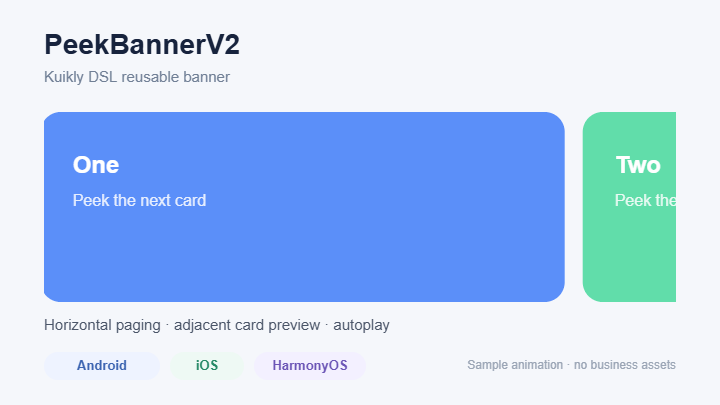
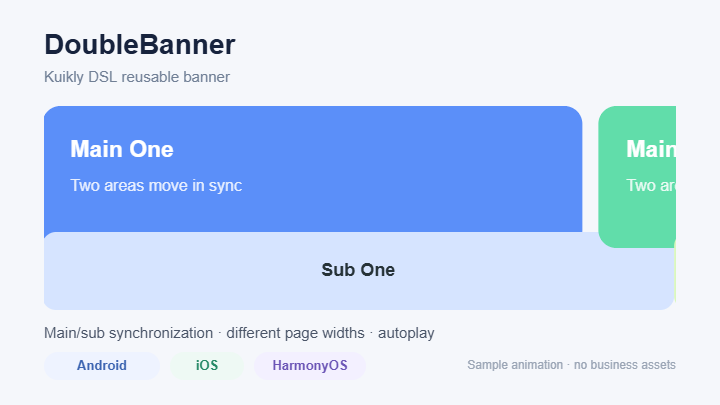
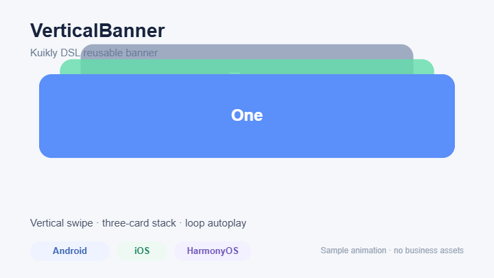

# KuiklyBanner

`KuiklyBanner` 是基于 [KuiklyUI](https://github.com/Tencent-TDS/KuiklyUI) 传统 DSL 的跨端轮播组件库，包含三个不依赖业务模型和图片资源的基础组件：

- `PeekBannerV2`：支持露出相邻卡片、横向或纵向分页、无限循环、自动播放和自定义 Item。
- `DoubleBanner`：支持主、副两个 PageList 双向手势联动、不同分页宽度、重叠布局、无限循环和自动播放。
- `VerticalBanner`：支持垂直手势切换、层叠卡片、无限循环、自动播放和自定义 Item。

三个组件均已在实际企业级 App 中使用，并支持 Android、iOS 与 HarmonyOS。组件源码全部位于 `commonMain`，不调用浏览器接口、不使用协程或多线程，可用于 Kuikly 动态化模式。

本仓库是独立维护、独立构建和独立发布的开源项目，不依赖原业务工程、业务包名、业务模型、埋点接口或私有资源。公共 Kotlin 包名为 `io.github.nobbyyinchen.kuikly.banner`。

## 平台

| Android | iOS | HarmonyOS | H5 / 小程序 | 动态化 |
| --- | --- | --- | --- | --- |
| 支持 | 支持 | 支持 | 支持 | 支持 |

macOS、Linux、Windows 和 tvOS 尚未纳入 CI 验证范围，因此当前不作兼容性承诺。

## 接入

当前仓库默认支持发布到 Maven Local：

```shell
./gradlew :kuikly-banner:publishToMavenLocal
```

在业务工程的 `commonMain` 中添加依赖：

```kotlin
dependencies {
    implementation("io.github.nobbyyinchen.kuikly:kuikly-banner:1.0.0")
}
```

开发阶段也可以把本仓库作为子工程引入，并使用：

```kotlin
implementation(project(":kuikly-banner"))
```

本仓库使用 Kuikly `2.23.2-2.1.21`。如业务工程采用其他 Kotlin/Kuikly 组合，请在 `gradle.properties` 中同步修改 `KUIKLY_VERSION`，避免 KMP 元数据版本不一致。

## PeekBannerV2

`width` 是可见窗口宽度，`pageItemWidth` 是单次分页步长。让 `width` 大于 `pageItemWidth`，即可露出下一张卡片。

[](docs/demo/peek-banner.webm)

点击预览图可播放 6 秒效果测试视频。

```kotlin
PeekBannerV2 {
    attr {
        width = 375f
        height = 120f
        pageItemWidth = 319f
        pageItemHeight = 120f
        loopPlayIntervalTimeMs = 3_000

        initSliderItems(items) { currentItem, nextItem ->
            View {
                attr {
                    width(303f)
                    height(120f)
                    marginRight(16f)
                    borderRadius(12f)
                    backgroundColor(currentItem.color)
                }
            }
        }
    }
    event {
        pageIndexDidChanged { params ->
            val index = (params as JSONObject).optInt("index")
        }
    }
}
```

`currentItem` 用于渲染当前卡片，`nextItem` 方便实现需要同时感知下一项的过渡样式。调用 `scrollToPage(index, animation)` 可主动切页；越界索引会按数据量循环归一化。

## DoubleBanner

主、副列表可以使用不同的分页宽度。任一列表被拖动时，另一列表会按页进度实时同步。

[](docs/demo/double-banner.webm)

点击预览图可播放 6 秒效果测试视频。

```kotlin
DoubleBanner {
    attr {
        containerWidth = 375f
        mainHeight = 180f
        subHeight = 72f
        mainPageItemWidth = 319f
        subPageItemWidth = 375f
        overlapHeight = 24f
        loopPlayIntervalTimeMs = 3_000

        initSliderItems(
            dataList = items,
            mainCreator = { item, _ ->
                View {
                    attr {
                        width(303f)
                        height(180f)
                        marginRight(16f)
                        backgroundColor(item.color)
                    }
                }
            },
            subCreator = { item, _ ->
                View {
                    attr {
                        width(375f)
                        height(72f)
                        backgroundColor(item.secondaryColor)
                    }
                }
            },
        )
    }
    event {
        pageIndexDidChanged { params ->
            val index = (params as JSONObject).optInt("index")
        }
    }
}
```

## VerticalBanner

当前卡片显示在最前方，后续卡片按照 `stackSpacing`、`scaleStep` 和 `opacityStep` 形成垂直层叠；上滑或下滑可切页。

[](docs/demo/vertical-banner.webm)

点击预览图可播放 6 秒效果测试视频。

```kotlin
VerticalBanner {
    attr {
        width = 375f
        height = 168f
        itemHeight = 120f
        visibleStackCount = 3
        stackSpacing = 24f
        scaleStep = 0.1f
        opacityStep = 0.2f
        loopPlayIntervalTimeMs = 3_000

        initSliderItems(items) { item, _ ->
            View {
                attr {
                    width(343f)
                    height(120f)
                    borderRadius(12f)
                    backgroundColor(item.color)
                }
            }
        }
    }
    event {
        pageIndexDidChanged { params ->
            val index = (params as JSONObject).optInt("index")
        }
        itemClick { params ->
            val index = (params as JSONObject).optInt("index")
        }
    }
}
```

演示视频由仓库示例参数生成，只展示通用交互和占位色块，不包含企业 App 的业务数据、品牌或图片素材。生成器见 [`docs/demo/generate-demo.html`](docs/demo/generate-demo.html)。

## 属性约束

- `pageItemWidth` / `mainPageItemWidth` / `subPageItemWidth` 应大于 `0`；否则对应的分页进度同步会被安全跳过。
- `visibleStackCount` 至少按 `1` 处理；`stackSpacing`、`scaleStep`、`opacityStep`、`swipeThreshold` 和动画时长的负值会被安全归一化。
- `loopPlayIntervalTimeMs <= 0` 会关闭自动播放；运行时修改该值会重启计时。
- `defaultPageIndex` 和 `scrollToPage` 的索引都是业务数据的 `0-based` 逻辑索引，不包含内部影子节点。
- 传入 `initSliderItems` 的列表会被复制，后续修改原列表不会破坏当前轮播的索引映射；数据变化时请重新构建组件。

完整示例见 [`BannerExample.kt`](sample/src/commonMain/kotlin/io/github/nobbyyinchen/kuikly/banner/sample/BannerExample.kt)。

## 构建与测试

```shell
./gradlew :kuikly-banner:jsNodeTest \
  :kuikly-banner:compileReleaseKotlinAndroid \
  :sample:compileKotlinJs \
  :sample:compileReleaseKotlinAndroid
```

HarmonyOS 使用 Kuikly 定制 Kotlin 工具链。请先按 [KuiklyUI 官方说明](https://github.com/Tencent-TDS/KuiklyUI#running-ohos-app) 配置 `OHOS_SDK_HOME`、`TOOL_HOME` 及定制编译器，再执行：

```shell
./gradlew -c settings.ohos.gradle.kts :kuikly-banner:compileKotlinMetadata
```

## 向 KuiklyUI third-party 目录登记

发布公开 GitHub 仓库后，把 [`registry/KuiklyUI-Libraries-entry.json`](registry/KuiklyUI-Libraries-entry.json) 中的对象追加到 `KuiklyUI-third-party/KuiklyUI-Libraries.json`，校验 JSON 后提交 PR。该流程遵循 [KuiklyUI-third-party 贡献说明](https://github.com/Tencent-TDS/KuiklyUI-third-party/blob/main/README-zh_CN.md)。

## License

[MIT](LICENSE)
